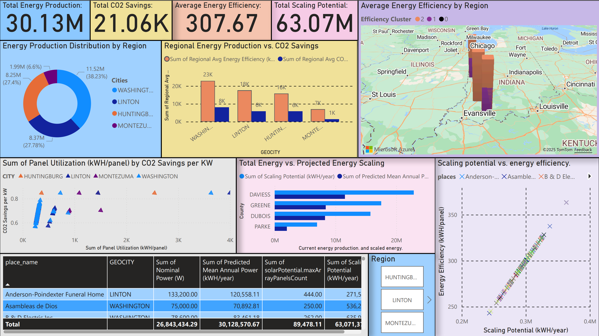

# Community Solar Energy Dashboard (Power BI)

This repo contains a Power BI dashboard that explores community solar adoption for selected sites in Indiana.  
The goal is to help decision-makers see where solar is already performing well and where there’s room to scale.

---
https://app.powerbi.com/groups/me/reports/716baf59-5b64-49fe-a3e3-d2ca222c025b/ff30e1632d5db37307bb?experience=power-bi

## What this dashboard shows

The dashboard focuses on four big questions:

- How much energy are these sites currently producing?
- How much CO2 are we actually saving?
- Which regions and sites are most efficient?
- What’s the realistic scaling potential if we add more panels?

Key views include:

- **KPI cards** – total energy production, total CO2 savings, average energy efficiency, and total scaling potential  
- **Production distribution by region** – donut and bar charts comparing cities/regions  
- **Map view** – average energy efficiency by region, with simple performance clusters  
- **Scaling vs efficiency scatter** – which sites give the “best return” if expanded  
- **Current vs projected energy scaling** – how production changes if we use the estimated potential  
- **Detail table** – site-level metrics (power, predicted annual energy, panel counts, scaling potential)

---

## How this was built (data → analysis → dashboard)

### 1. Data prep

- Started from an internal community / nonprofit solar dataset from Indiana University work.  
- Cleaned organization names and addresses to reduce duplicates and mismatches.  
- Joined in solar-potential fields (nominal power, predicted annual output, max panel count, etc.).

### 2. Feature engineering

To compare sites fairly and highlight “high-impact” locations, I created:

- **Energy efficiency (kWh/panel)** – productivity per installed panel  
- **CO2 savings per kW** – environmental benefit per unit of capacity  
- **CO2 savings per panel** – another efficiency lens focused on panels  
- **Scaling potential (kWh/year)** – projected extra energy if each site is built out to its estimated panel capacity  
- **Regional averages** – production, efficiency, and CO2 savings rolled up by city/region

### 3. Analysis & modelling

Most of the analysis happened in Python and Power BI:

- Ran quick EDA and validation (scatter plots, correlations, sanity checks on units).  
- Grouped regions/sites into simple performance “bands” based on efficiency and scaling potential.  
- Built current vs projected energy bars to show the gap between today’s output and what’s possible if sites are fully utilized.

### 4. Power BI dashboard

The final cleaned dataset was loaded into Power BI Desktop:

- Created **calculated columns** and **measures** for all metrics above.  
- Built the visuals in the screenshot (cards, bar/column charts, scatter plots, map, and table).  
- Added slicers for **Region/City** so you can filter everything to a specific area.

